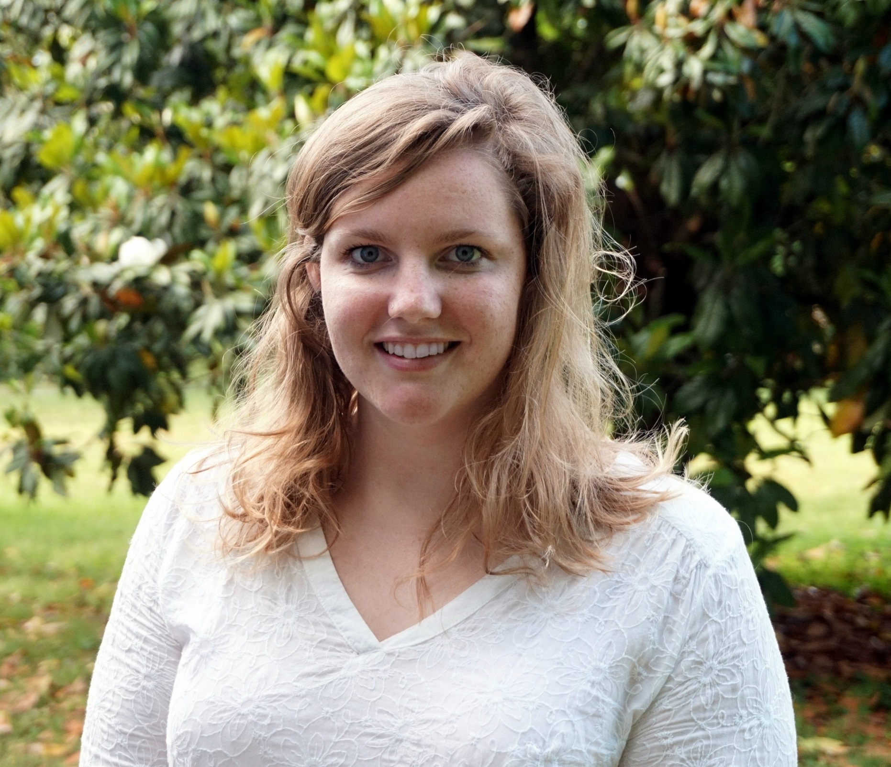

## About

I am a second year Ph.D. student in Geospatial Analytics at NC State University advised by Dr. Sandra Yuter.

I completed my Bachelor's degree in Meteorology at NC State in 2017. While I was I then went on to complete a Master's degree in Atmospheric Science in 2019 at The University of Kansas where I was advised by Dr. David Mechem. For my M.S. thesis I used the WRF model to simulate stratocumulus cloud-eroding boundaries over the southeast Atlantic Ocean. After finishing my master's, I came back to NC State to persue my Ph.D. in Geospatial Analytics. For my current research, I use remotely sensed data from satellite, ground-based radar, and aircraft radar to observe the dynamic features within winter storms. 

## Contact 

Email: [lmtomkin@ncsu.edu](lmtomkin@ncsu.edu) 

 [Twitter](https://twitter.com/lauratomkinsWX) 
 [Google Scholar](https://scholar.google.com/citations?user=tJl0fHYAAAAJ&hl=en&oi=ao)
 [GitHub](https://github.com/lauratomkins)
 [LinkedIn](https://www.linkedin.com/in/laura-tomkins/)
