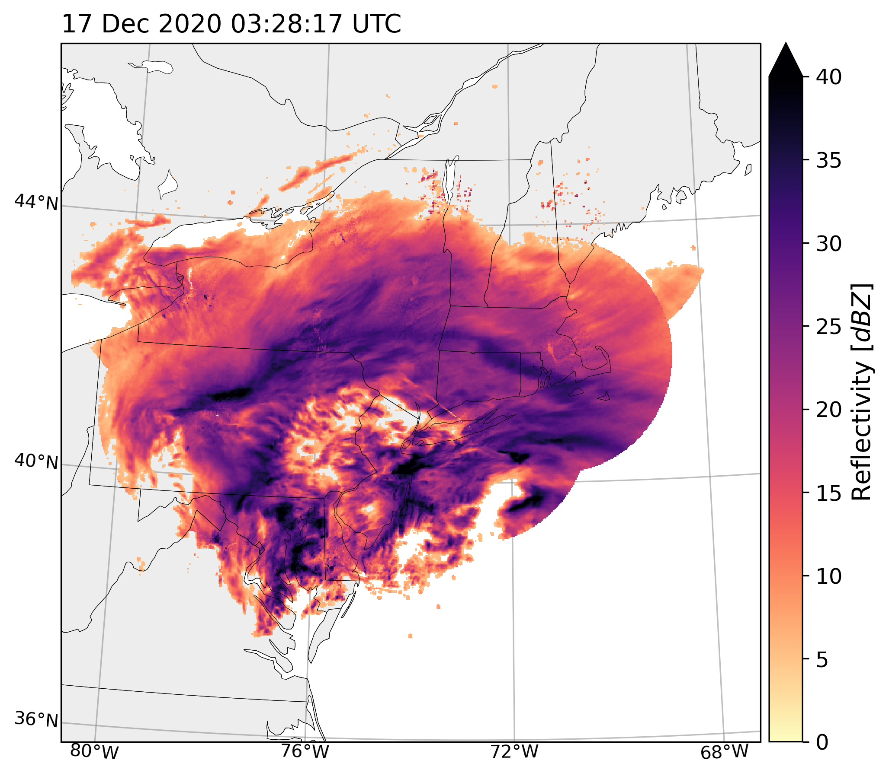

## Research

# Winter Weather

I use remotely sensed data from satellite, ground-based radar, and aircraft radar to observe the dynamic features within winter storms. 

## IMPACTS Field Campaign

# Stratocumulus Cloud-Eroding Boundaries

# RELAMPAGO Field Campaign

